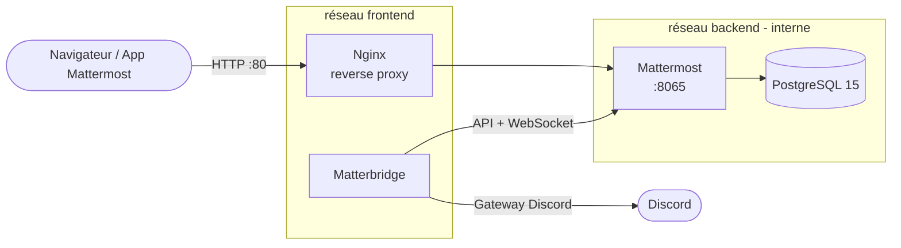

# IM Bridge - Mattermost ⇄ Discord

Stack Docker Compose qui déploie un serveur **Mattermost** (messagerie) et un **bridge vers Discord**, afin que les utilisateurs présents sur Discord puissent échanger avec ceux de Mattermost sans changer d'outil.

---

## Sommaire

- [Contexte](#contexte)
- [Architecture](#architecture)
- [Services](#services)
- [Démarrage rapide](#démarrage-rapide)
- [Variables d'environnement](#variables-denvironnement)
- [Configurer le bridge Discord](#configurer-le-bridge-discord)
- [Stack de développement](#stack-de-développement)
- [Fonctionnalités Docker avancées](#fonctionnalités-docker-avancées)
- [Sécurité](#sécurité)
- [Structure du projet](#structure-du-projet)
- [Commandes utiles](#commandes-utiles)
- [Avancement](#avancement)

---

## Contexte

Les utilisateurs sont répartis sur plusieurs services de messagerie de groupe concurrents. L'objectif est de leur permettre de communiquer **depuis et vers** le service de l'entreprise (Mattermost) à partir de leur compte sur un autre service (Discord).

Objectifs pédagogiques :

- comprendre et tester Docker / Docker Compose sur un projet multi-services ;
- étudier les possibilités de networking offertes par Docker ;
- sécuriser les images et le stack applicatif ;
- utiliser des fonctionnalités avancées (Watch, fragments, cgroups, multi-stage, healthchecks) ;
- proposer un environnement de développement / configuration distinct de la production.

---

## Architecture



Principes :

- **Seul Nginx expose un port** sur l'hôte. Mattermost et PostgreSQL ne sont joignables que depuis les réseaux Docker.
- **PostgreSQL n'est attaché qu'au réseau `backend`** : il n'est accessible ni depuis l'extérieur, ni depuis Nginx, ni depuis le bridge.
- **Le bridge** parle à Mattermost via son API (compte bot dédié) et à Discord via un bot Discord. Il n'a jamais accès à la base de données.
- Le démarrage est ordonné par des **healthchecks** : `db` → `mattermost` → `nginx` / `bridge`.

---

## Services

| Service      | Image de base                                           | Rôle                                                    | Réseaux                  |
| ------------ | ------------------------------------------------------- | ------------------------------------------------------- | ------------------------ |
| `db`         | `postgres:15-alpine`                                    | Base de données de Mattermost                           | `backend`                |
| `mattermost` | `mattermost/mattermost-enterprise-edition:release-9.11` | Serveur de messagerie (API + WebSocket sur `:8065`)     | `frontend`, `backend`    |
| `nginx`      | `nginx:alpine`                                          | Reverse proxy, point d'entrée unique, upgrade WebSocket | `frontend`               |
| `bridge`     | `42wim/matterbridge:1.26.0`                             | Relais des messages Mattermost ⇄ Discord                | `frontend`               |

Volumes persistants : `db-data`, `mm-data`, `mm-config`, `mm-logs`, `mm-plugins`.

---

## Démarrage rapide

### Prérequis

- Docker Engine ≥ 24 et Docker Compose v2 (`docker compose`, pas `docker-compose`)
- Un serveur Discord sur lequel vous êtes administrateur (pour le bridge)

### Installation

1. Cloner le dépôt puis copier le fichier d'exemple des variables d'environnement :

```bash
cp .env.example .env
```

2. Éditer `.env` et remplacer au minimum les valeurs `change_me` (voir [Variables d'environnement](#variables-denvironnement)).

3. Construire et lancer le stack :

```bash
docker compose up -d --build
```

4. Vérifier que tous les services sont `healthy` :

```bash
docker compose ps
```

5. Ouvrir <http://localhost> (ou le port défini dans `NGINX_PORT`), créer le compte administrateur et la première équipe Mattermost.

---

## Variables d'environnement

Toute la configuration passe par le fichier `.env` (jamais versionné). Le fichier [`.env.example`](.env.example) sert de modèle.

### PostgreSQL

| Variable            | Description             | Exemple      |
| ------------------- | ----------------------- | ------------ |
| `POSTGRES_USER`     | Utilisateur de la base  | `mmuser`     |
| `POSTGRES_PASSWORD` | Mot de passe de la base | `change_me`  |
| `POSTGRES_DB`       | Nom de la base          | `mattermost` |

### Mattermost

Mattermost lit directement les variables préfixées `MM_` pour surcharger son `config.json` (format `MM_<SECTION>_<CLÉ>`).

| Variable                     | Description                      | Exemple                                                          |
| ---------------------------- | -------------------------------- | ---------------------------------------------------------------- |
| `MM_SQLSETTINGS_DRIVERNAME`  | Driver SQL                       | `postgres`                                                       |
| `MM_SQLSETTINGS_DATASOURCE`  | Chaîne de connexion à PostgreSQL | `postgres://mmuser:change_me@db:5432/mattermost?sslmode=disable` |
| `MM_SERVICESETTINGS_SITEURL` | URL publique du serveur          | `http://localhost`                                               |

> ⚠️ Le mot de passe apparaît à la fois dans `POSTGRES_PASSWORD` et dans `MM_SQLSETTINGS_DATASOURCE` : les deux doivent rester identiques.

### Nginx

| Variable     | Description                     | Exemple |
| ------------ | ------------------------------- | ------- |
| `NGINX_PORT` | Port exposé sur la machine hôte | `80`    |

### Bridge Discord

| Variable               | Description                                |
| ---------------------- | ------------------------------------------ |
| `DISCORD_TOKEN`        | Token du bot Discord                       |
| `DISCORD_SERVER`       | ID (ou nom) du serveur Discord à relier    |
| `DISCORD_CHANNEL`      | Salon Discord relié (ex. `general`)        |
| `MATTERMOST_BOT_TOKEN` | Token d'accès du compte bot Mattermost     |
| `MATTERMOST_TEAM`      | Nom de l'équipe Mattermost                 |
| `MATTERMOST_CHANNEL`   | Canal Mattermost relié (ex. `town-square`) |

---

## Configurer le bridge Discord

Le bridge repose sur [Matterbridge](https://github.com/42wim/matterbridge), qui supporte nativement Mattermost et Discord. La configuration se trouve dans [`mattermost/bridge/matterbridge.toml.tmpl`](mattermost/bridge/matterbridge.toml.tmpl) (Matterbridge n'accepte que le format TOML). Au démarrage, `entrypoint.sh` vérifie que les variables du `.env` sont renseignées puis les injecte dans le template avec `envsubst` : les secrets ne sont jamais écrits dans le dépôt.

Le bridge parle directement à `mattermost:8065` via le réseau `frontend` ; il n'a pas accès au réseau `backend` (base de données).

### 1. Créer le bot Discord

1. Aller sur le [Discord Developer Portal](https://discord.com/developers/applications) → **New Application**.
2. Onglet **Bot** → **Reset Token** et copier le token dans `DISCORD_TOKEN`.
3. Activer **Message Content Intent** et **Server Members Intent**.
4. Onglet **OAuth2 → URL Generator** : cocher `bot`, puis les permissions _Read Messages/View Channels_, _Send Messages_, _Read Message History_, _Manage Webhooks_ (optionnel, pour afficher le pseudo et l'avatar d'origine).
5. Ouvrir l'URL générée et inviter le bot sur votre serveur.
6. Récupérer l'ID du serveur (mode développeur Discord → clic droit sur le serveur → _Copier l'identifiant_) dans `DISCORD_SERVER`.

### 2. Créer le bot Mattermost

1. **Console système → Intégrations → Comptes bot** : activer la création de comptes bot.
2. **Intégrations → Comptes bot → Ajouter** : créer un bot (ex. `discord-bridge`) et copier son token dans `MATTERMOST_BOT_TOKEN`.
3. Ajouter le bot à l'équipe et au canal à relier.

### 3. Relancer le bridge

```bash
docker compose up -d bridge
```

```bash
docker compose logs -f bridge
```

Un message posté dans le canal Mattermost doit apparaître dans le salon Discord, et inversement.

---

## Stack de développement

Le fichier [`docker-compose.dev.yml`](docker-compose.dev.yml) surcharge la configuration de production pour faciliter le développement et la mise au point de la configuration :

- **Compose Watch** : modification de `nginx.conf` ou de la configuration du bridge → synchronisation et redémarrage automatique du service ;
- ports de debug exposés (Mattermost `:8065`, PostgreSQL `:5432`) uniquement en local ;
- logs plus verbeux et absence de limites de ressources strictes.

Lancer le stack de dev :

```bash
docker compose -f docker-compose.yml -f docker-compose.dev.yml up --build --watch
```

---

## Fonctionnalités Docker avancées

| Fonctionnalité               | Mise en œuvre dans le projet                                                                                                             |
| ---------------------------- | ---------------------------------------------------------------------------------------------------------------------------------------- |
| **Fragments / YAML anchors** | Bloc `x-common` (`restart`, rotation des logs `json-file`) réutilisé par tous les services via `<<: *common`.                            |
| **Networking**               | Réseaux `frontend` et `backend` séparés ; seul Nginx publie un port ; la base n'est jamais exposée.                                      |
| **Healthchecks**             | `pg_isready` pour PostgreSQL, `/api/v4/system/ping` pour Mattermost, requête HTTP pour Nginx ; `depends_on: condition: service_healthy`. |
| **Images personnalisées**    | Un `Dockerfile` par service dans `mattermost/<service>/` (healthcheck embarqué, utilisateur non-root, configuration intégrée).           |
| **Multi-stage build**        | Image du bridge compilée depuis les sources Go dans un stage `builder`, puis copiée dans une image finale minimale sans toolchain.       |
| **Cgroups**                  | Limites `cpus`, `memory` et `pids_limit` par service pour éviter qu'un service n'affame les autres.                                      |
| **Compose Watch**            | Rechargement automatique de la configuration en développement (`develop.watch`).                                                         |

---

## Sécurité

- **Secrets hors du dépôt** : `.env` est ignoré par Git, seul `.env.example` (valeurs factices) est versionné.
- **Surface d'exposition minimale** : un seul port publié (Nginx). Mattermost, PostgreSQL et le bridge ne sont accessibles que sur les réseaux internes.
- **Isolation réseau** : la base de données n'est joignable que par Mattermost ; le bridge passe par l'API Mattermost avec un compte bot aux droits limités.
- **Utilisateurs non-root** dans les conteneurs (`USER mattermost`, utilisateur dédié pour le bridge).
- **Images légères** basées sur Alpine / distroless pour réduire la surface d'attaque.
- **Rotation des logs** (`max-size: 10m`, `max-file: 3`) pour éviter la saturation du disque.
- **Limites de ressources** (cgroups) pour contenir l'impact d'un service compromis ou défaillant.

---

## Structure du projet

```text
.
├── docker-compose.yml          # Stack de production
├── docker-compose.dev.yml      # Surcharge pour le développement (watch, ports de debug)
├── .env.example                # Modèle des variables d'environnement
└── mattermost/
    ├── db/
    │   └── Dockerfile          # PostgreSQL 15 Alpine + healthcheck
    ├── mattermost/
    │   ├── Dockerfile          # Mattermost + healthcheck, utilisateur non-root
    │   └── config.json         # Configuration Mattermost de base
    ├── nginx/
    │   ├── Dockerfile          # Nginx Alpine
    │   └── nginx.conf          # Reverse proxy + upgrade WebSocket
    └── bridge/
        ├── Dockerfile              # Matterbridge, utilisateur non-root
        ├── entrypoint.sh           # Vérifie le .env et génère la config
        └── matterbridge.toml.tmpl  # Passerelle Mattermost ⇄ Discord (template)
```

---

## Commandes utiles

Afficher l'état et la santé des services :

```bash
docker compose ps
```

Suivre les logs d'un service :

```bash
docker compose logs -f mattermost
```

Valider la configuration Compose résolue (variables, fragments, surcharges) :

```bash
docker compose config
```

Observer la consommation de ressources (cgroups) :

```bash
docker stats
```

Inspecter un réseau et les conteneurs qui y sont attachés :

```bash
docker network inspect docker_backend
```

Arrêter le stack en conservant les données :

```bash
docker compose down
```

Tout supprimer, volumes compris :

```bash
docker compose down -v
```
